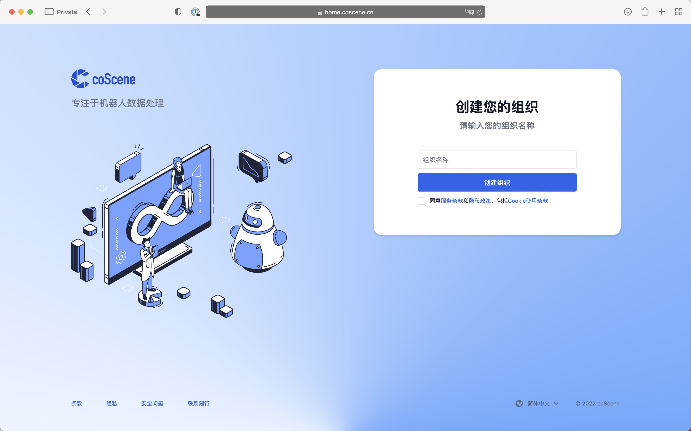

# 数据模型

## 组织 Organization

组织是一个逻辑概念，它代表了一个团队或者一个公司。组织可以拥有多个项目，也可以拥有多个成员。

在登录刻行平台时，如果你是所选择组织中第一个登录刻行平台的用户，你会成为该组织的管理员，并进行组织的初始化设置。
如果你不是第一个登录的用户，你将会成为该组织的普通成员。

## 设备 Device

设备是指可以连接到刻行平台的任何物理设备，比如：智能终端、智能手表、智能手环、智能眼镜、智能车载设备、智能家居设备等。

组织中的任何成员都可以在组织中添加设备。在组织中添加的设备会在所有的项目中可见。关于设备的详细操作，请参见[设备的操作指南](../4-receipts/device/1-device.md)。

## 项目 Project

组织作为资源的管理容器，本身并不会存储任何用户和设备在运行时产生的数据。对于数据的存储、管理、隔离和应用都发生在项目级别。项目作为数据管理的单元，同时也负责

## 记录 Record

很多的已有系统和工具都能处理单个或者单一序列的文件，例如 WebViz 能直接打开一个 Bag 文件进行播放，Uber XVIZ 能用一系列的 GLB 和 json 文件还原事件发生时的场景，这些都是了不起的工程能力。但在开发机器人和自动驾驶等复杂系统中，许多环境因素以及程序和人为的干预，都会使得单个文件或者文件序列不足以完整的还原系统运行时的情况。

一个设备在运行和研发过程中所产生的文件，不仅仅有数据本身，还包括例如所运行软件版本、气候、路面情况、硬件配置、校准文件、地图等一系列直接或者简介关联的数据。记录就是为了这种复杂的关联关系而生，在同一个容器内存储相互紧密关联的文件，并在后期处理时，把这些文件有机的关联在一起。

记录本身也会不停的迭代和丰富，用户和工作流可以不断的向记录内更新有用的信息。一个常见的例子就是原始数据可以被送往如百度和清华等标注供应商，进行特定框体，语义等的标注。这些标注信息在后续的机器学习、训练、和测试等流程中都会发挥巨大的作用。

在文件管理之上，刻行也对文件的版本和血缘进行了管理。你可能听过机器学习界的一句名言，garbage in garbage out，即垃圾输入垃圾输出。在刻行平台中，我们通过记录的版本和血缘管理，来保证数据的质量。在记录的版本中，我们可以看到记录的历史版本，以及每个版本的修改记录。在记录的血缘中，我们可以看到记录的上游和下游记录，以及每个记录的血缘关系。关于血缘和历史版本的详细信息，请参看关于记录对于[血缘和历史版本的说明](../4-receipts/record/4-manage-records.md)。

## 支持的数据格式和平台处理能力

| 数据格式   | 读取   | 写入   |
| ---------- | ------ | ------ |
| ROS1       | ✅     |        |
| MCAP       | ✅     | ✅     |
| CyberRT    | ✅     |        |
| 非标准格式 | 可定制 | 可定制 |
