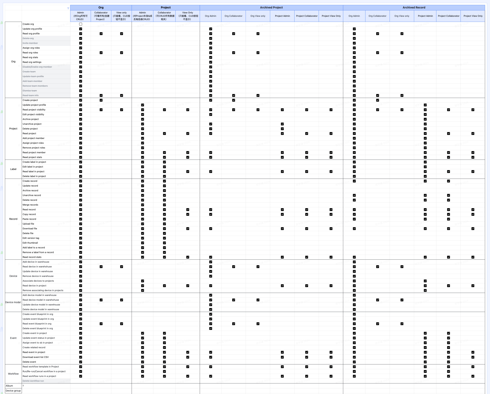

# 用户和权限

数据是所有刻行用户最重要的资产，在让用户能高效利用数据的同时，我们也充分重视用户对于数据资产的安全和保密性的要求。从第一天开始，我们就在设计和构建一个灵活的、可扩展的、可配置的权限模型，以满足我们的客户的保密、安全、和控制的需要。

刻行目前的权限体系充分参考了行业内最佳实践，充分考虑了 [RBAC](https://en.wikipedia.org/wiki/Role-based_access_control) 和 [ABAC](https://en.wikipedia.org/wiki/Attribute-based_access_control) 模型对于我们应用的影响。在目前阶段，刻行的实现以 RBAC 作为基础，但会在接下来的发布中，逐渐引入 ABAC 的特性。最终达到一个灵活而又易懂的权限设置模型。

## 组织和项目

作为应用的权限容器载体，刻行主要对各项资源进行了两层的划分。第一层是组织，所有刻行的实际用户都应属于一个现实团体，在刻行内的映射就是组织。组织不拥有实际的数据资源，但是拥有组织内实际资源主体，如设备，人员，并在组织层面赋予组织成员的角色。

组织同时也是项目的所有方(Owner)，每个组织可有拥有任意多个项目。项目作为用户和设备产生数据的容器载体，是刻行内部的第二层权限资源隔离体系。设备产生的文件和记录，设备和用户所生成的事件，各类请求之间的流转关系，这一切都发生在项目内部。一些特殊的资源还有在项目内特定的实例，比如一些私有设备，暂时不方便公布在整个组织内的，就可以添加在项目内部进行管理(注：项目级别的设备实例尚未上线，具体上线时间请关注我们的[开发计划页面](../5-roadmap/1-roadmap.md))。

## 权限和资源

刻行平台根据上述的权限体系和原则，在系统内为所有的资源预定义了各类动作(Action)和策略(Policy)，并依次定义了模板角色，依次为：

### 组织

1. 组织管理员
2. 成员
3. 只读成员

### 项目

1. 项目管理员
2. 成员
3. 只读成员

当一个用户有用项目的角色时，该用户项目内的角色会被优先使用。这一情况不适用于管理员角色，组织管理员目前拥有最高的权限，能访问所有的项目，并且会忽略项目内的角色设置(如果有)。

不同的预定义角色会对不同的资源有不一样的权限，完整的权限矩阵参见下图：

[点击查看大图](./img/auth-matrix.jpg)

## 参考

1. [Original Authorization Concept](https://coscene0.feishu.cn/wiki/wikcnfje0fLsDRX4MHV5IcUCirh)
