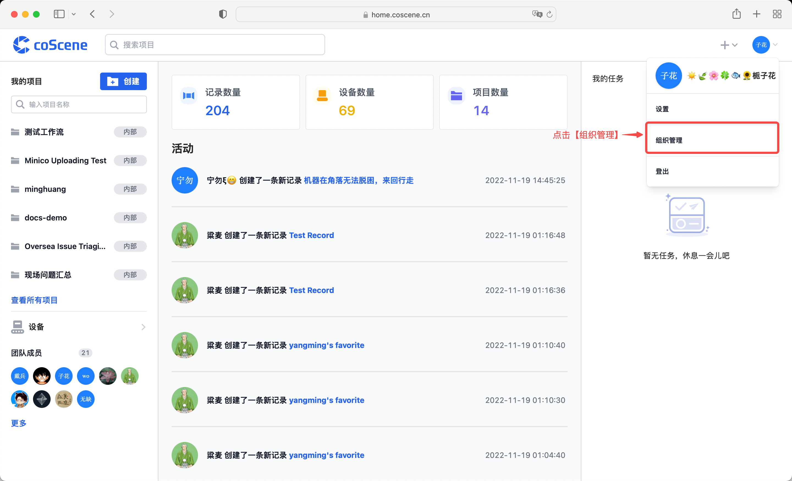
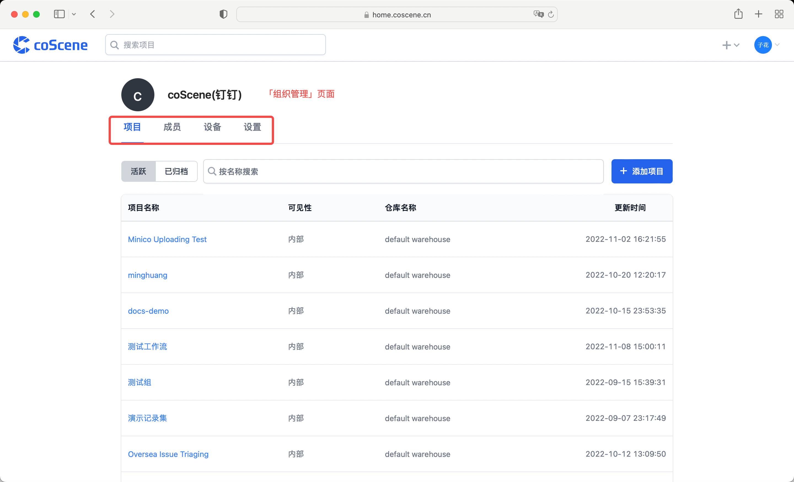
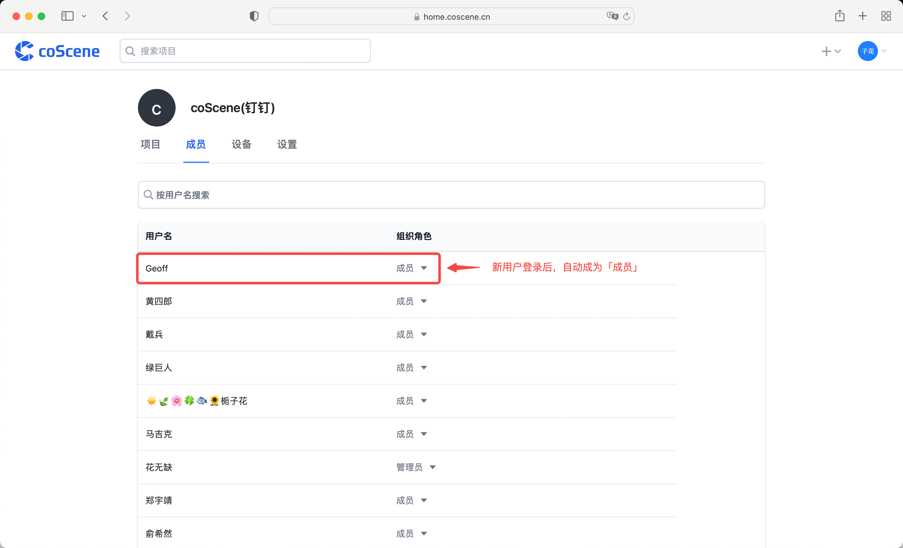
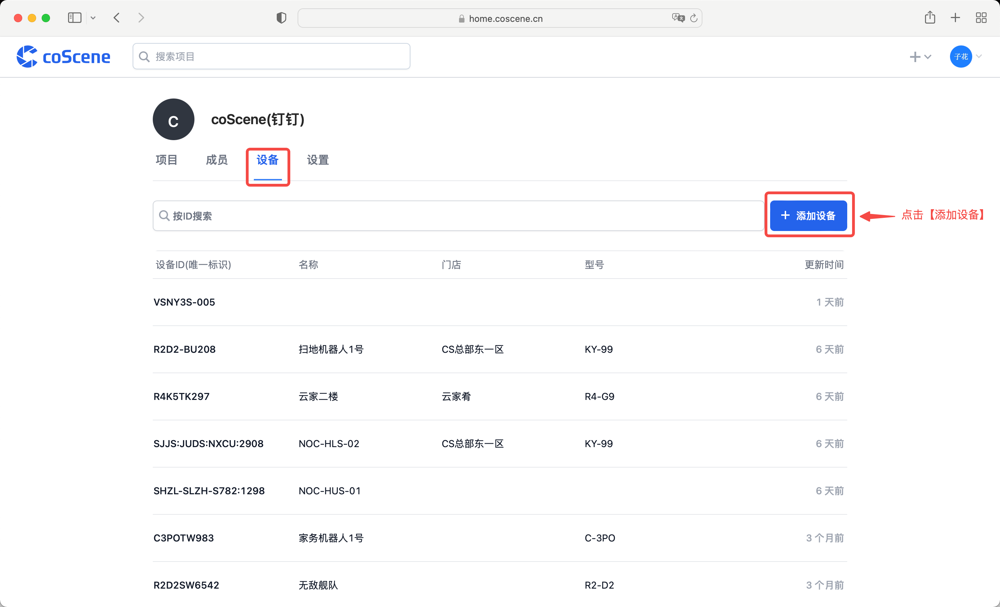
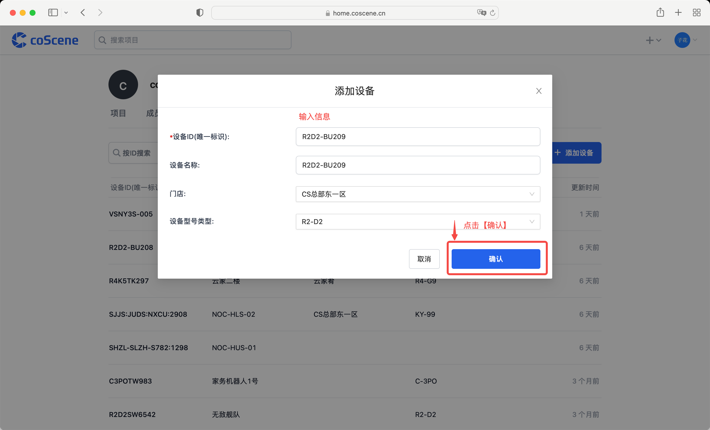
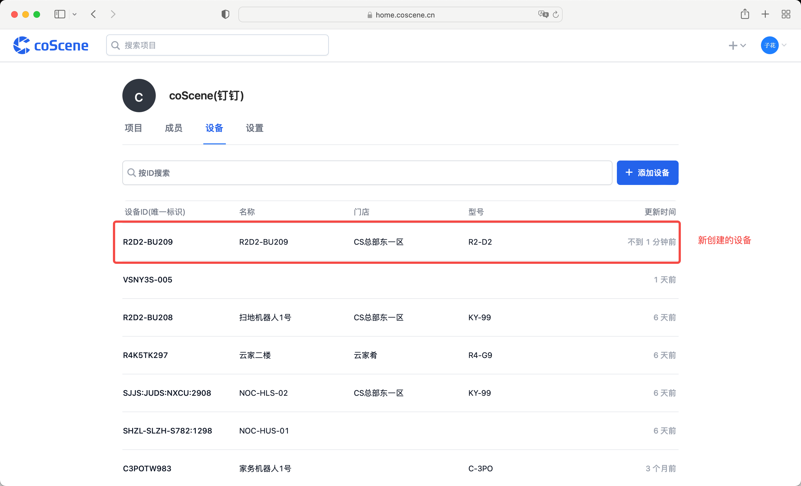
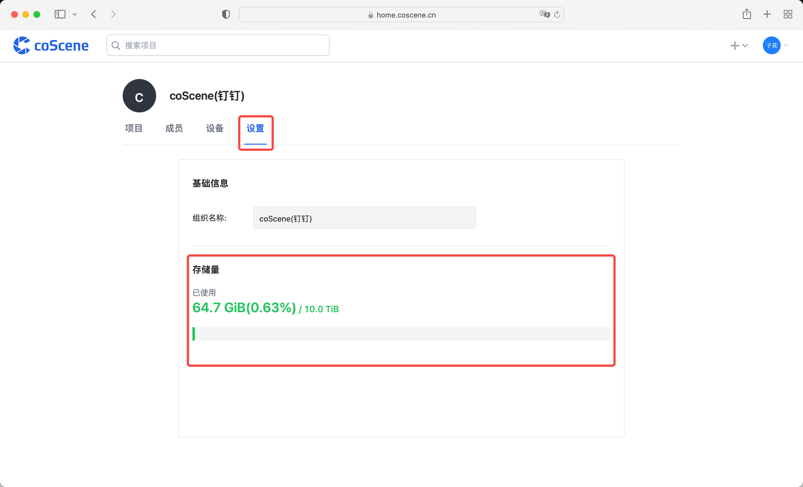

# 组织

您和您的团队将自动加入同一组织。在「组织管理」页面，可以查看组织的项目、成员、设备以及统计信息。

## 在组织中添加项目

请参见[操作指南中关于项目的部分](../4-receipts/2-project.md)

## 在组织中添加成员

> 以某钉钉公司成员登录为例

某钉钉公司的用户登录后，自动加入公司的组织，成为组织的「成员」，拥有组织成员权限。

当用户离开公司，不再是钉钉公司的成员，则无法再进入原组织。但仍保留该用户的操作记录。

## 在组织中添加设备

> 组织中的设备可以被各个项目调用。

在「组织管理」页面的「设备」分页，点击【添加设备】按钮。

在「添加设备」弹框中，输入设备 ID 及其他信息后，点击【确认】。其中，设备 ID 为唯一标识，不可重复。

成功添加设备。

## 查看组织统计信息

> 谁可以使用这个功能 
> 仅组织管理员可查看组织统计信息

组织统计信息包括：组织存储量、组织记录数量、组织项目数量、组织设备数量

在「组织管理」页面的「设置」分页，可以查看组织存储量。

在主页，可以查看组织记录数量、项目数量以及设备数量。

