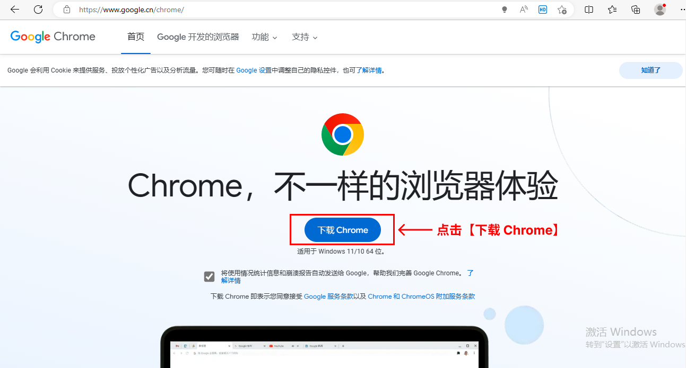
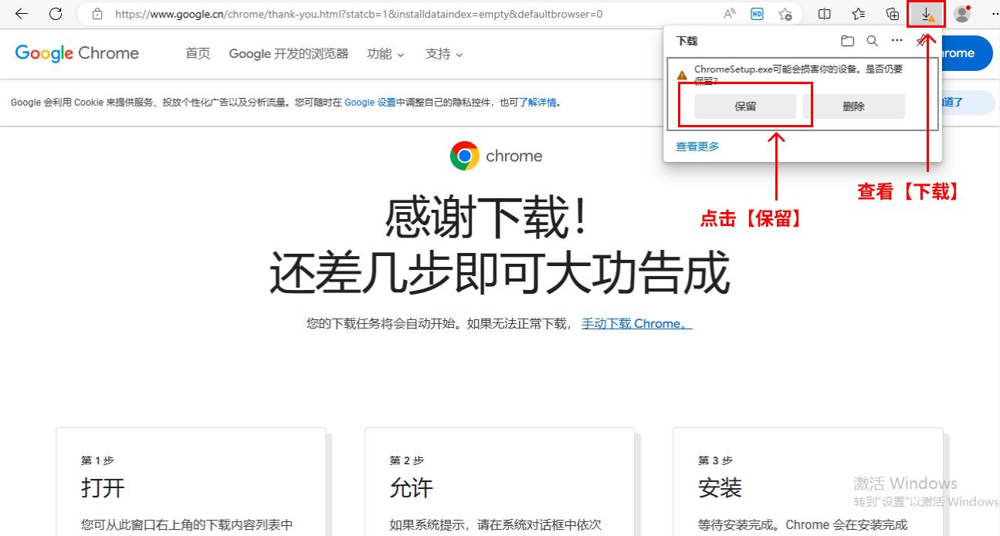
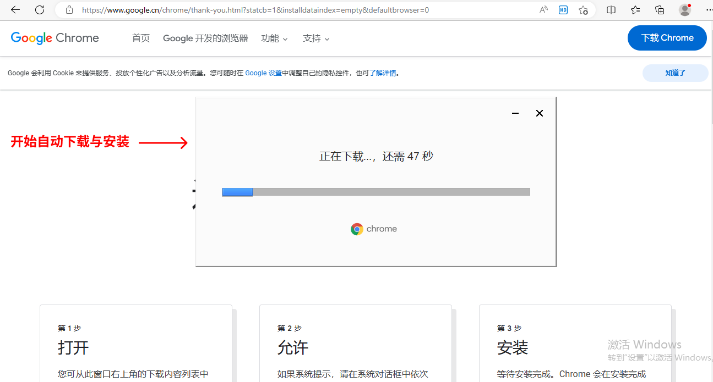
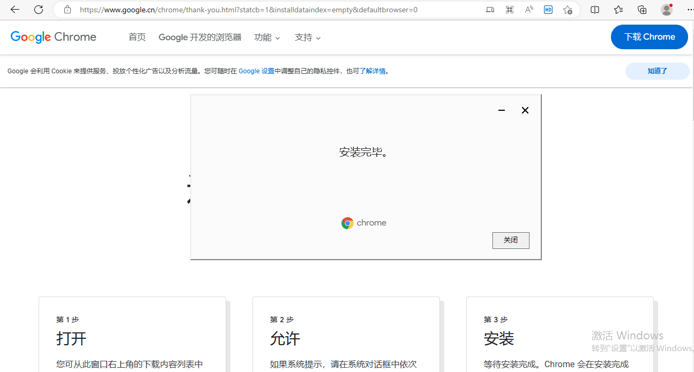
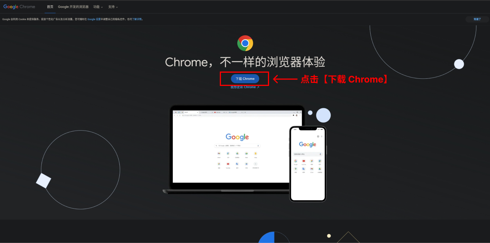
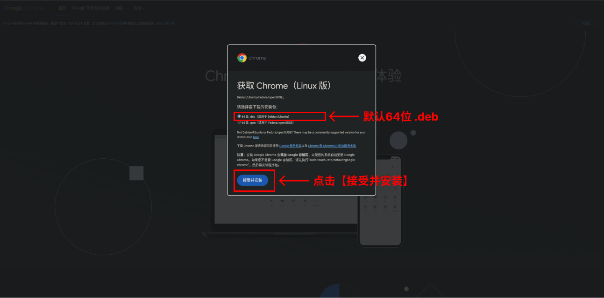

# Chrome 浏览器的下载与安装

刻行平台目前仅支持 Chrome 104+，为了更好的产品使用体验，推荐升级到 Chrome 浏览器最新版本。以下为在 Windows 系统和 Linux 系统中安装 Chrome 浏览器的详细教程。

## Windows 系统安装 Chrome 浏览器

1. 打开 [Chrome 浏览器下载页面](https://www.google.cn/chrome/)

2. 点击【下载 Chrome】按钮，下载默认的 .exe 安装包。

3. 下载成功后，在浏览器中点击【下载】按钮；若提示「ChromeSetup.exe可能会损害你的设备，是否仍要保留？」，选择【保留】。

4. 在浏览器跳出的弹框中点击【打开文件】，开始安装浏览器。

5. 安装成功后，在桌面生成 Chrome 图标，点击即可启动 Chrome 浏览器。

6. 若打开后仍为旧版 Chrome，则重启 Chrome 浏览器。

## Linux 系统安装 Chrome 浏览器

1. 打开 [Chrome 浏览器下载页面](https://www.google.cn/chrome/)

2. 点击【下载 Chrome】按钮，选择默认的 ubuntu 64 位 .deb 安装包，点击【接受并安装】。

3. 安装包下载完成后，进入到该包的下载目录，右键打开终端，执行：`sudo dpkg -i *****.deb`（`*****.deb`是下载的安装包名称）。

4. 若在安装过程中提示缺少依赖，执行：`sudo apt-get -f install`

5. 启动 Chrome 浏览器：在搜索栏中搜索"g"，便会出现 chrome 的图标，点击打开。

