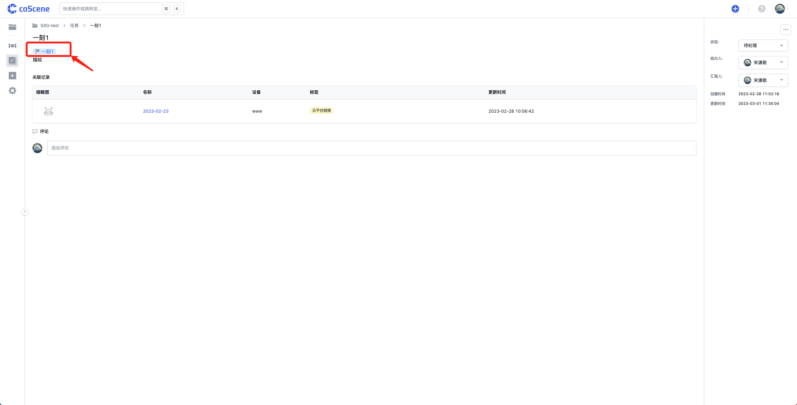

# 创建任务

任务 (task) 流转是用户通过刻行平台进行项目协作的重要方式，组织用户可以针对一条记录创建、分配与处理若干任务，与其他成员共同合作；将任务、评论与「一刻」等有效结合可以提高工作质量与效率。

本章节将从创建任务开始，帮助你了解如何利用任务高效进行协作。

## 从记录详情页创建任务

你可以进入任务详情页中的「评论&任务」模块，针对一条记录创建与之关联的任务。在创建任务时指定经办人并添加对任务的描述，以使得相关用户可以结合有效信息完成任务流程。

<video src="https://coscene-artifacts-prod.oss-cn-hangzhou.aliyuncs.com/docs/4-receipts/task/create-task-in-record.mp4" controls="controls" width="700" height="400"></video>

 

## 从可视化界面创建任务

在可视化界面中播放记录内容时，你可以通过创建「一刻」进行关键帧的标记，同时勾选「创建一条关联的任务」以便捷推进工作进展，免去需要跳转到记录详情页创建任务并引用「一刻」的流程。

<video src="https://coscene-artifacts-prod.oss-cn-hangzhou.aliyuncs.com/docs/4-receipts/task/create-task-with-moment.mp4" controls="controls" width="700" height="400"></video>

 

 

创建的任务会在描述中自动引用该「一刻」，帮助有关成员实现快速定位。

 
