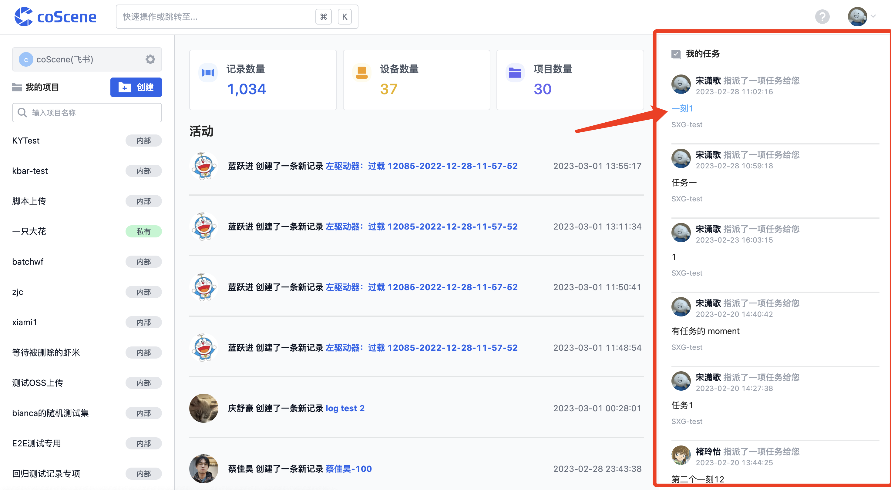
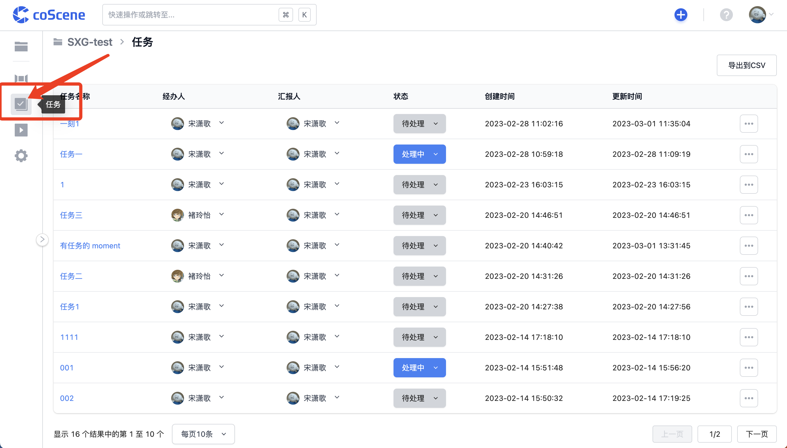

# 处理任务

## 查看任务

在刻行主页的右侧「我的任务」中，你可以看到指派给你且未处理完成的任务列表；点击任务标题即可跳转至对应任务详情页面，查看任务信息并进行处理。

 

你也可以进入项目中，点击页面左侧栏中的「任务」，查看项目中所有的任务并进行操作。

 

## 处理任务

### 变更任务状态

一项任务有「待处理」、「处理中」、「已完成」三种状态；一项任务在创建时状态默认为「待处理」，组织成员可以根据任务实际进度变更任务状态。

你可以点击任务页面的「状态」修改任务状态。

<video src="https://coscene-artifacts-prod.oss-cn-hangzhou.aliyuncs.com/docs/4-receipts/task/change-task-status.mp4" controls="controls" width="700" height="400"></video>

当一项任务完成并变更状态至「已处理」后，将不会再出现在经办人首页的任务列表中。

 

### 编辑任务信息

你可以在任务详情页面，修改任务标题与描述。

<video src="https://coscene-artifacts-prod.oss-cn-hangzhou.aliyuncs.com/docs/4-receipts/task/edit-task.mp4" controls="controls" width="700" height="400"></video>

 

### 流传任务至相关成员

在当前经办人完成该任务属于自己工作范畴内的工作，或在其他状况下需要将当前任务指派给其他组织成员时，可以改变任务的「经办人」信息完成任务的流传

你可以通过改变「经办人」，将任务流转给其他相关用户；被指定为经办人的用户会收到提示。

<video src="https://coscene-artifacts-prod.oss-cn-hangzhou.aliyuncs.com/docs/4-receipts/task/change-assignee.mp4" controls="controls" width="700" height="400"></video>

 

## 为任务添加评论

与记录类似，用户同样可以针对某项任务进行评论，获取与添加与任务相关的更多信息。

你可以在任务的详情界面添加评论，@ 以提及其他用户，添加相关链接等信息以提高任务处理效率。

<video src="https://coscene-artifacts-prod.oss-cn-hangzhou.aliyuncs.com/docs/4-receipts/task/add-comment-to-task.mp4" controls="controls" width="700" height="400"></video>

 

 

## 删除任务

点击任务详情页面右上角的操作按钮，删除该任务：

<video src="https://coscene-artifacts-prod.oss-cn-hangzhou.aliyuncs.com/docs/4-receipts/task/delete-task.mp4" controls="controls" width="700" height="400"></video>

 

 

你也可以在项目的「任务」列表中删除任务：

<video src="https://coscene-artifacts-prod.oss-cn-hangzhou.aliyuncs.com/docs/4-receipts/task/delete-task-in-list.mp4" controls="controls" width="700" height="400"></video>

 
