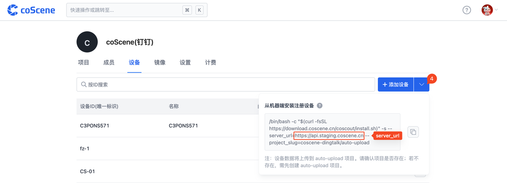

# 数采规则

数采规则定义触发数据自动采集的条件：当某个事件发生时，自动采集指定目录下的数据。以设备端日志报错误码时采集数据为例，<a href="https://coscene-artifacts-prod.oss-cn-hangzhou.aliyuncs.com/docs/4-receipts/device/collector-rule.yaml.zip" download>点击此处下载</a> 示例数采规则文件并进行修改。

数采规则主要对五个模块进行设置：

- 默认设置：抓取数据后，需要上传到的项目
- 事件设置：当事件发生后，是否触发数据采集
- 存储设置：设备端数据的存储地址；触发事件后，采集数据的时间范围
- 数据收集器设置：完成数据采集后，是否删除设备端数据
- 日志设置：监控的日志级别

<br />

## 默认设置

设置数据存储的地址和密钥

```yaml
# 默认设置
default:
  server_url: https://api.coscene.cn  # API 服务器的 URL 地址
  api_key: xxxxxxxxxxxxxxxxx  # 用于服务器身份验证的 API 密钥
  project_slug: default/auto-upload  # 项目别名
```

- **server_url**：API 服务器的 URL 地址，需根据实际替换

  

  
  

- **api_key**：用于服务器身份验证的 API 密钥，获取方式如下

  

  

  
  

- **project_slug**：项目别名，即 ORG_SLUG/PROJECT_SLUG

  

<br />

## 事件代码设置

设置触发数据采集的事件和条件

```yaml
# 事件代码设置
event_code:
  enabled: True  # 是否启用事件代码
  whitelist:
    1001: 8 # 白名单设置：错误码 1001 发生后会触发自动上传，最多触发 8 次
  reset_interval_in_sec: 86400  # 重置间隔，以秒为单位
  code_json_url: https://example.com/coscout/code.json  # 事件代码的JSON数据源地址
```

- **whitelist**：在白名单中的事件错误码发生时，会触发数据的自动上传。可设置该错误码发生后，最多上传的次数，防止同一问题多次重复上报
  
- **reset_interval_in_sec**：重置关于错误码「最多上传的次数」的设置。例如 86400 表示 24 小时后，当同一错误码再次发生时，「上传次数」重新从 1 开始计数
  
- **code_json_url**：事件代码的 JSON 数据源地址

<br />

## 存储设置

设置设备端数据的存储地址，以及触发事件后，采集数据的时间范围

```yaml
# Google Storage设置
gs:
  base_dir: /root/error_logs  # 错误日志的基本目录
  robot_yaml: /root/public/robot.yaml  # 机器人配置文件路径
  before_trigger_secs: 1800  # 触发前的秒数
  after_trigger_secs: 300  # 触发后的秒数
```

<br />

## 数据收集器设置

设置完成数据采集后，是否删除设备端数据，以释放设备端硬盘存储

```yaml
# 数据收集器设置
collector:
  delete_after_upload: False  # 上传后是否删除数据
```

<br />

## 日志设置

设置监控的日志级别

```yaml
# 日志设置
logging:
  version: 1  # 日志版本
  loggers:
    kebab.sources:  # kebab.sources的日志设置
      level: INFO  # 日志级别
    "":  # 默认的日志设置
      level: INFO  # 日志级别
```

<br />
