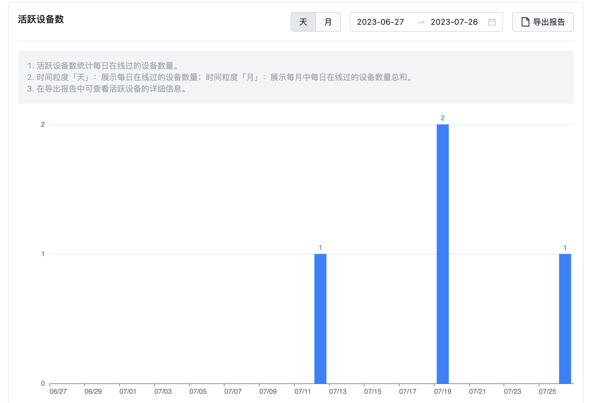

# 数采设备准入

在设备端完成数采程序的安装后，刻行平台的组织管理-设备页中，就会增加该设备，且其对应的准入状态为「待审核」。审核通过的设备即为「已准入」状态，准入的设备可按数据采集规则，将数据自动上传到项目中。

## 设备审核
> 仅组织管理员可审核设备

进入组织管理页面的「设备」分页

找到需要审核的设备，点击【同意准入】

设备准入成功

 

## 设备日活

准入的设备在联网状态下会进行数据的自动采集，联网的准入设备即为活跃设备。每日活跃的设备数量可在组织管理-计费分页中查看。

