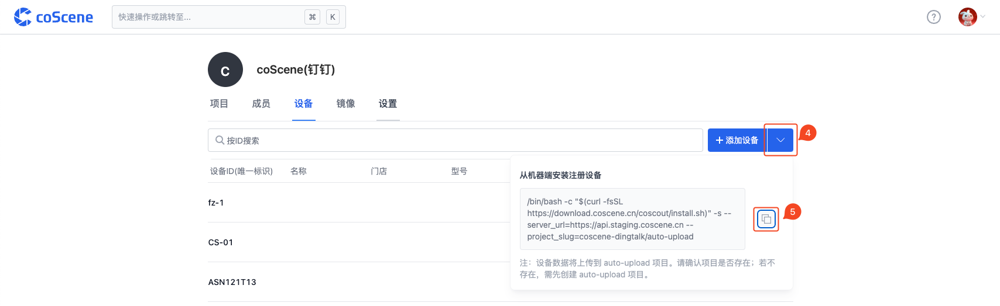
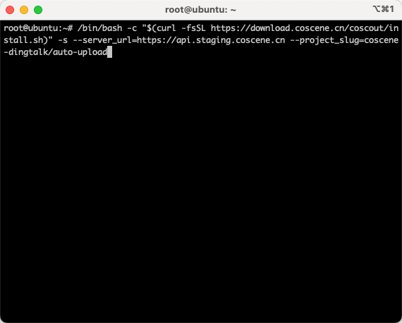
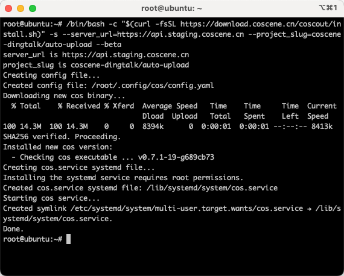
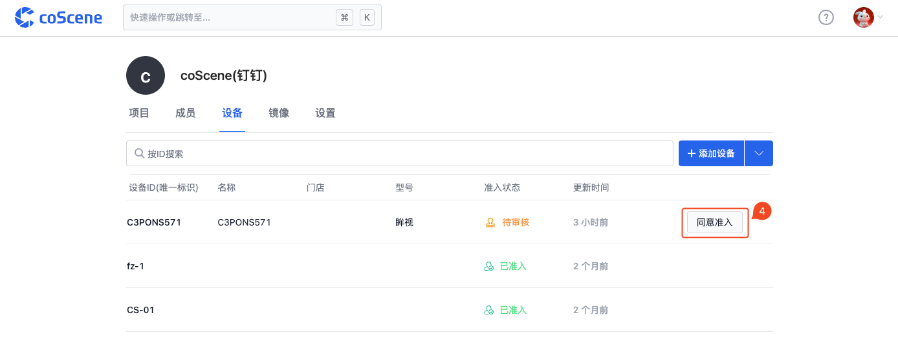
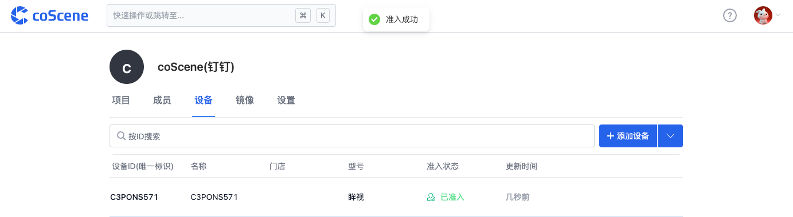

# 设备准入
> 准入的设备可按数据采集规则，将数据自动上传到项目中

<br />

## 设备注册

### 联网安装注册
进入组织管理页面的「设备」分页


复制安装命令



打开终端窗口，进入机器端，粘贴安装命令



安装完成，注册成功



<br />

### 离线安装注册

1. 下载 [install.sh](https://download.coscene.cn/coscout/install.sh) 安装脚本到设备端，**请注意需要给脚本提供执行权限 (命令行赋权操作 `chmod +x install.sh`)**
2. 下载 [cos_binaries.tar.gz](https://download.coscene.cn/coscout/tar/latest/cos_binaries.tar.gz) 离线二进制文件压缩包到设备端
3. 假设 `cos_binaries.tar.gz` 放置在设备的`/root/cos_binaries.tar.gz` 位置，在设备端执行本地安装命令 
```
$ ./install.sh --server_url=https://api.coscene.cn --project_slug=coscene/auto-upload --use_local=/root/cos_binaries.tar.gz
```
其中参数 `--server_url` 和 `--project_slug` 可以参考上面联网安装注册过程获取，`--use_local` 参数指定了离线二进制文件的路径。

## 设备审核
> 仅组织管理员可审核设备

进入组织管理页面的「设备」分页


找到需要审核的设备，点击【同意准入】



设备准入成功



<br />

## 数据上传监控日志

在机器端查看日志信息

```
journalctl -fu cos
```
