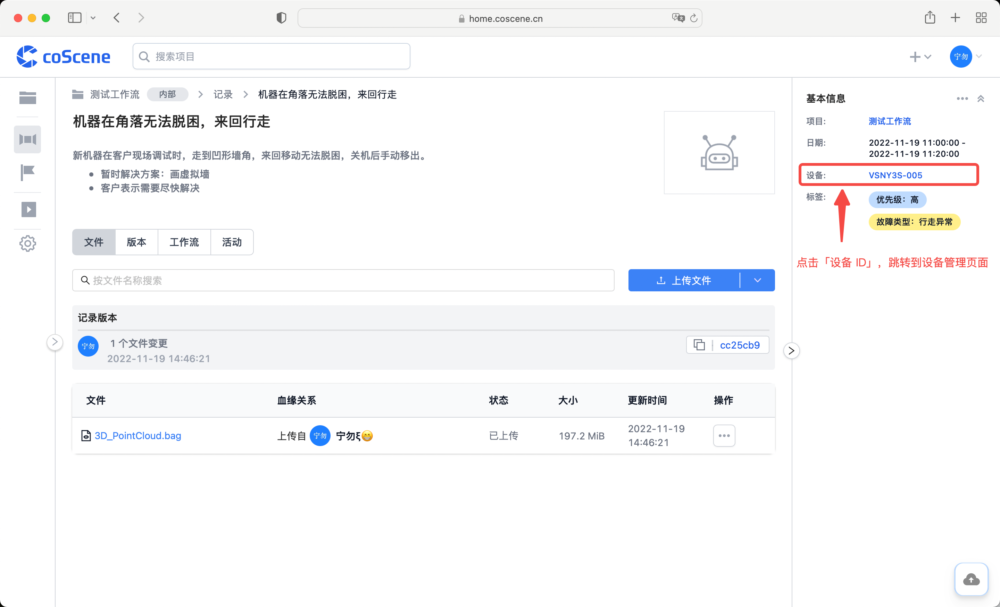
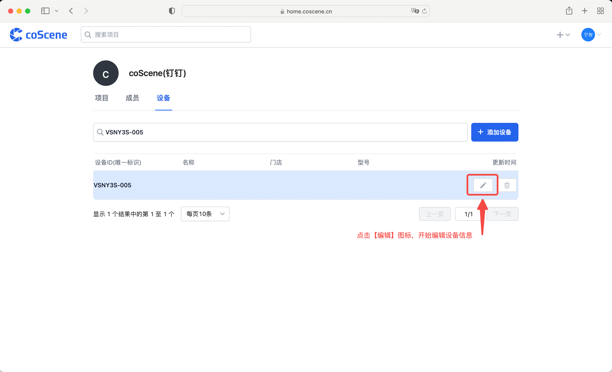
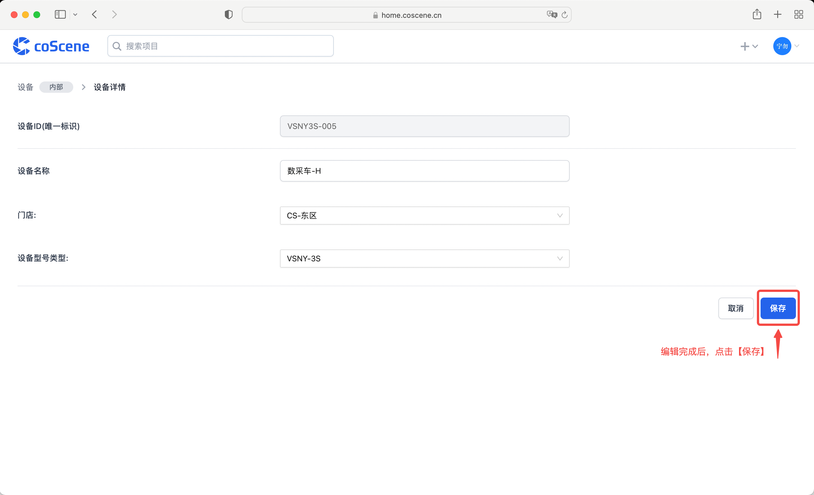
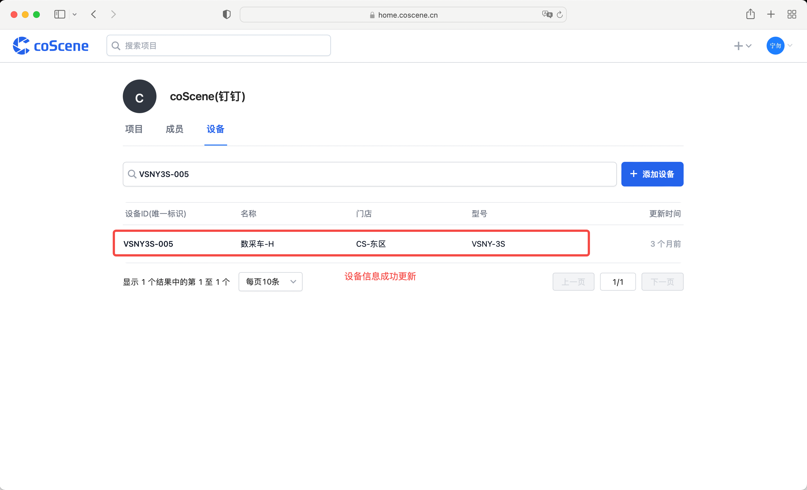
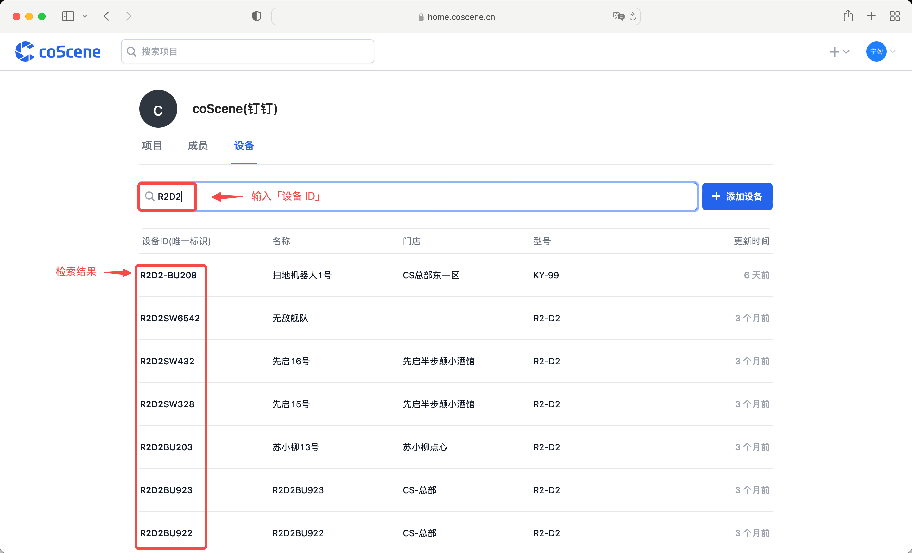
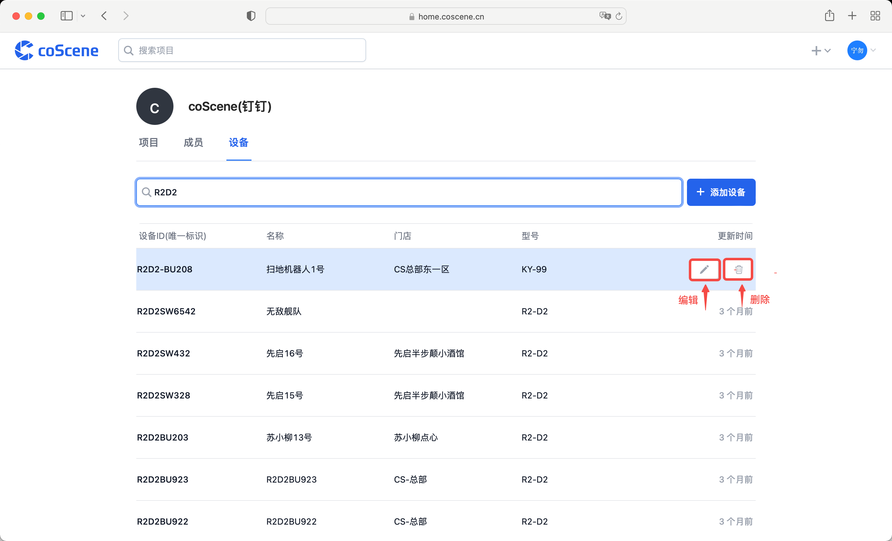

# 管理设备

设备在组织层面进行管理，组织内的设备可应用于所有项目。

## 从记录中编辑设备
> 从记录中查看设备详情，编辑设备信息

在记录详情页中，点击设备，跳转到设备管理页面。

点击【编辑】图标，开始编辑设备。

输入设备信息后，点击【保存】按钮。

设备信息被更新。

 

## 在组织中管理设备
> 在组织中检索、编辑、删除设备

进入组织管理页面的「设备」分页

在搜索框中输入「设备 ID」，检索出需要管理的设备。

在操作栏选择编辑或删除设备。

 
