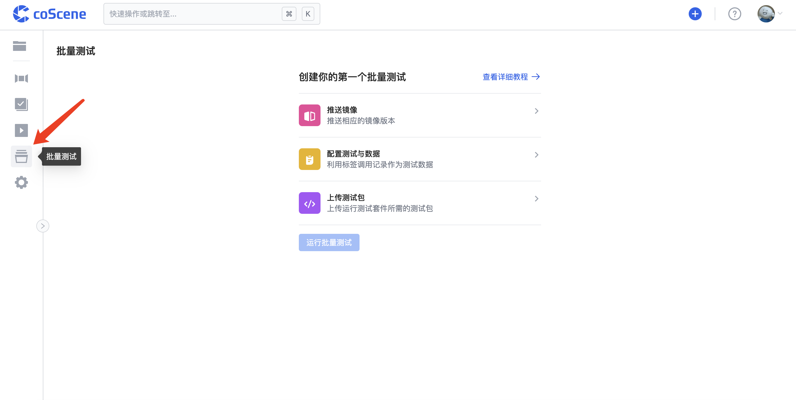

# 关于批量测试

批量测试旨在以产品化的方式满足用户对于大规模测试的需求，应用场景包括回归测试、仿真测试等。

用户可以在刻行平台上传并管理相关镜像、测试数据、测试套件与测试包，在项目范围内运行批量测试、监控进度并获取测试结果。

 

## 基本概念

  | 概念名称 | 说明 |
  | --- | --- |
  | 配置文件 (Config File) | 由用户编写的、指定批量测试运行所需参数的一个文件 *用户需要在运行批量测试前在项目中通过配置文件进行测试的配置，用户可以上传或在线编辑配置文件* |
  | 镜像 (Image) | 运行批量测试的虚拟环境 *用户可以在刻行平台推送镜像至当前组织并进行管理，在运行批量测试时需要指定使用的镜像版本* |
  | 测试套件 (Test Suite) | 通常是针对相同或相似测试场景的一组测试，在批量测试中一次性批量执行 *用户可以在刻行平台通过配置文件上传测试套件至当前项目中并进行管理* |
  | 测试包 (Test Bundle) | 通常是为执行测试用例而编写的一系列代码和相关依赖等 *用户可以在刻行平台上传测试包至当前项目，指定其种类与标签以进行版本管理；在运行批量测试时需要选择测试包版本* |
  | 测试用例 (Test Case) | 运行批量测试过程中执行的具体任务，通常从相应的测试报告中解析出 *用户可以在批量测试运行完毕后，在结果报告中查看测试报告解析出的测试用例详情与执行结果* |
  
 

## 使用流程概览

点击进入项目的「批量测试」页面，根据页面提示创建一个批量测试：

以下步骤概述为你提供了使用批量测试功能的一个基本流程：

  1. 将测试数据上传到刻行项目中，按照记录存储

  2. 确保组织内有相应可用镜像，或推送镜像至刻行平台

  3. 在「测试套件管理」页面上传或在线编辑配置文件，得到要执行批量测试的测试套件和相应配置参数

  4. 在「测试包管理」页面上传测试包文件，生成一个测试包版本；如果上传的测试包满足测试套件关联触发条件，则会自动触发批量测试

  5. 在「批量测试」页面点击按钮，选择运行参数（测试包版本、测试套件等）后运行批量测试；或直接在本地通过命令行运行批量测试

  6. 点击批量测试查看运行进度与测试结果

更多具体步骤请参见后续章节的详细说明。

 

 

:::success 

批量测试功能正处于快速开发迭代过程中，您可以访问 [批量测试-用户使用文档](https://coscene0.feishu.cn/wiki/wikcnlpDwycH3hosPkuKqGdVkxf) 以查看当前最新操作指南。

:::
