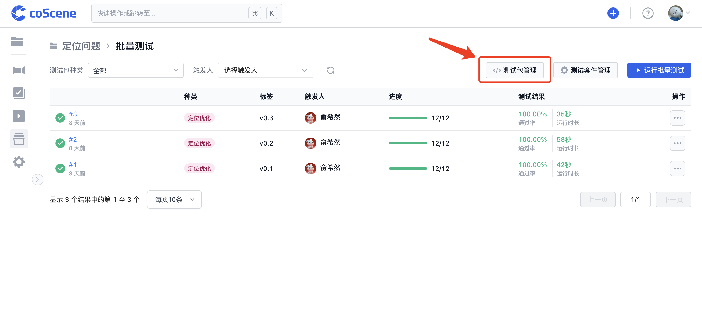
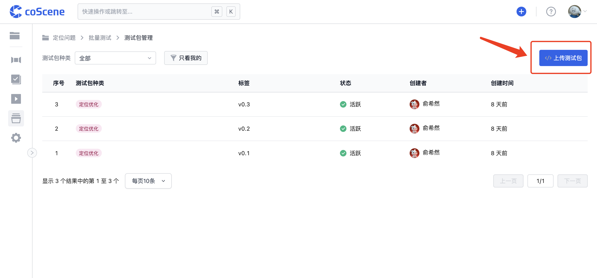
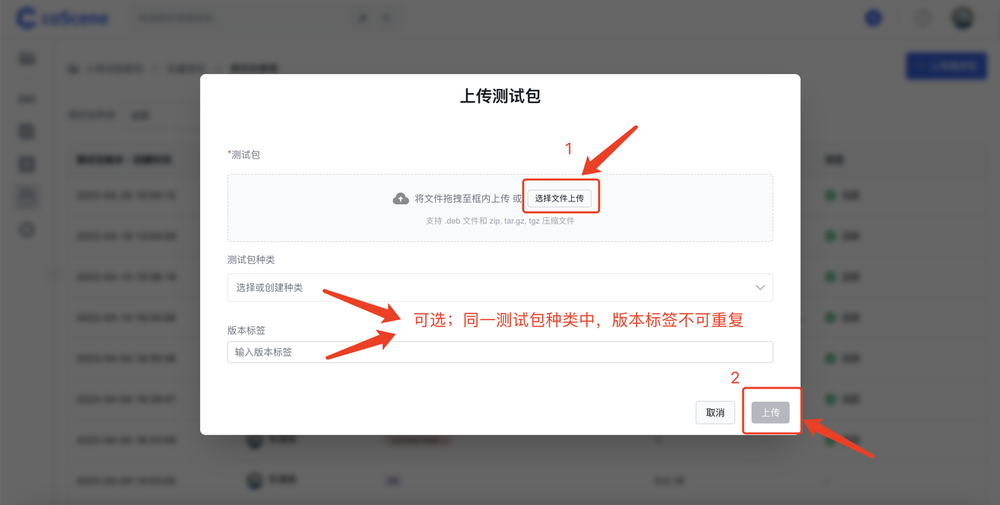

# 管理测试包

> 了解测试包文件内容示例，查看如何将测试包上传至刻行平台并进行相应版本管理。

## 1. 准备测试包文件

测试代码文件为一个 .deb 格式的文件或 .zip / .tgz / .tar.gz 格式的压缩文件。

你可以 <a href="https://coscene-artifacts-prod.oss-cn-hangzhou.aliyuncs.com/docs/4-receipts/regression/count" download>点击此处下载</a> 示例测试包文件。

 

## 2. 上传测试包文件

1. 点击进入「批量测试」-「测试包管理」页面：

 

2. 点击右上角「上传测试包」：

 

3. 点击右上角「上传测试包」：

 

4. 测试包列表「状态」栏显示「活跃」，即代表该测试包上传成功：

 

