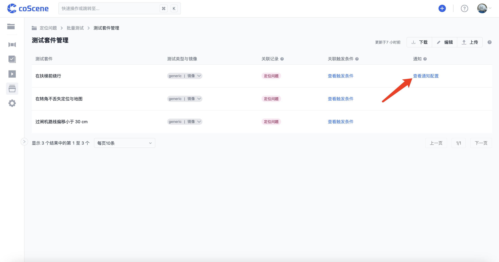
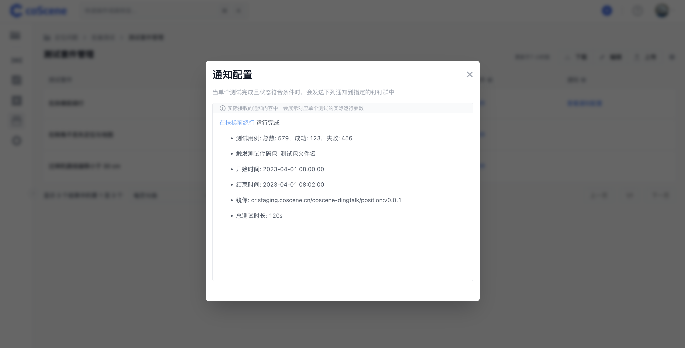

# 更多功能

> 你可以通过本章节的内容了解其他批量测试中涉及的内容，包括接收消息通知、创建一刻等。

<br />

## 接收消息通知

你可以在上传的配置文件中的「notifications」字段，设置在钉钉中接收测试套件运行相关信息，你可以使用自定义的模板规定接受的内容信息。

具体示例请参见 [配置文件格式与样例-消息通知](../regression/yaml-sample.md#消息通知) 章节。

在「批量测试-测试套件管理」页面中，对于配置了消息通知的测试套件，其「通知」列会显示「查看通知」按钮：



你可以点击「查看通知」按钮，查看该其消息模版内容：



<br />

## 创建一刻

批量测试的运行环境集成了 `cos` 命令行工具，可以在程序中运行以下命令创建一刻：

```yaml
/cos/bins/cos moment create \
    --display-name "急停" \ # moment 名字
    --description "机器急停" \ # moment 描述
    --trigger-time 1532402940 \ # moment 触发时间
    --duration 10 \ # moment 持续时长
    --customized-fields '{"key1": "value1"}' # moment 自定义字段
```

<br />
