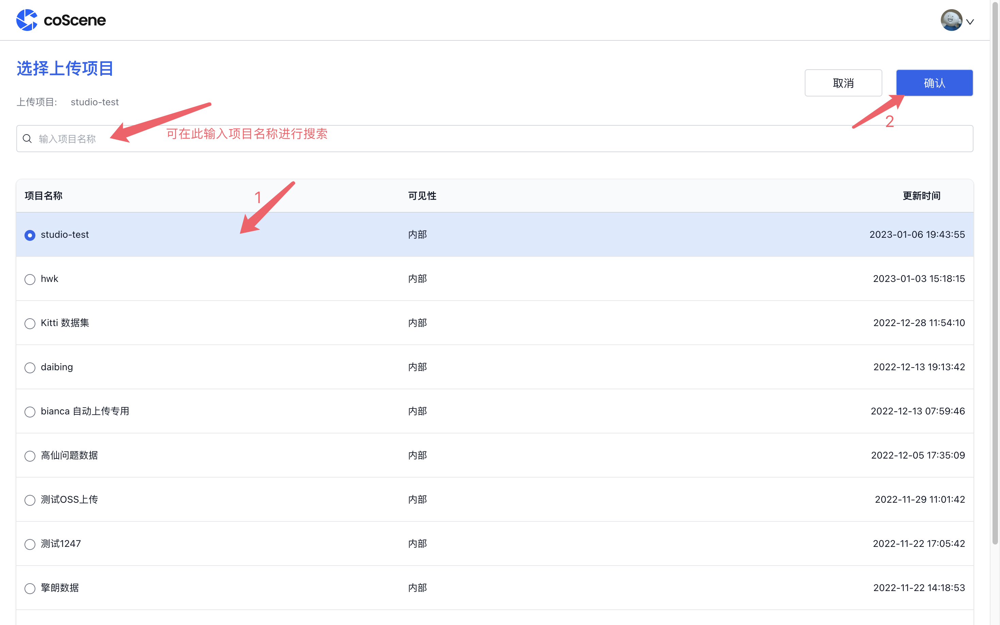
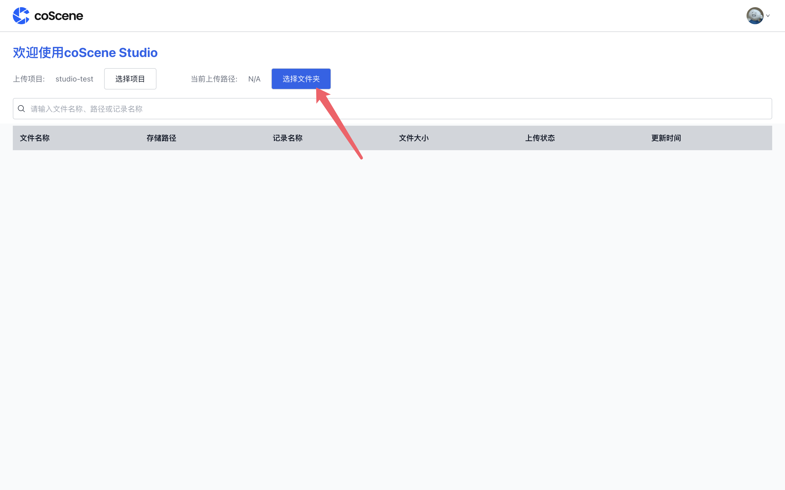
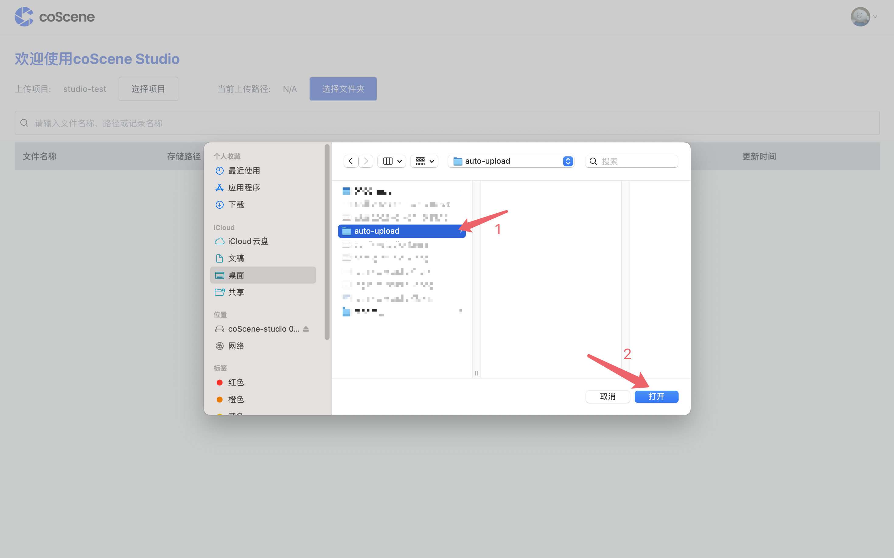

# 初次使用时的配置

## 1. 选择上传项目

项目是刻行进行数据管理的基本类型，云端生成的记录需要被归档于某一项目中，所以您需要先选择您希望数据要上传至哪一项目中。

点击「选择项目」，选择文件要上传至云端的项目（您可以在搜索框中输入项目名称进行查找）并点击「确认」：

## 2. 选择上传路径

您需要指定一个本地文件夹作为上传路径，本地拖拽至此文件夹中的文件将会被自动上传至云端对应的记录中。

点击「选择文件夹」，选择一个本地文件夹作为上传路径，之后点击「打开」确认：

