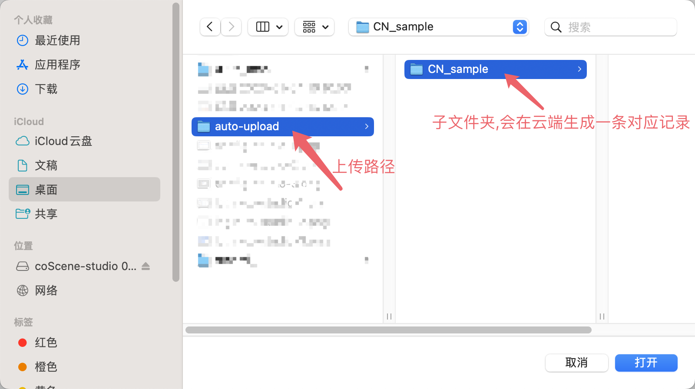
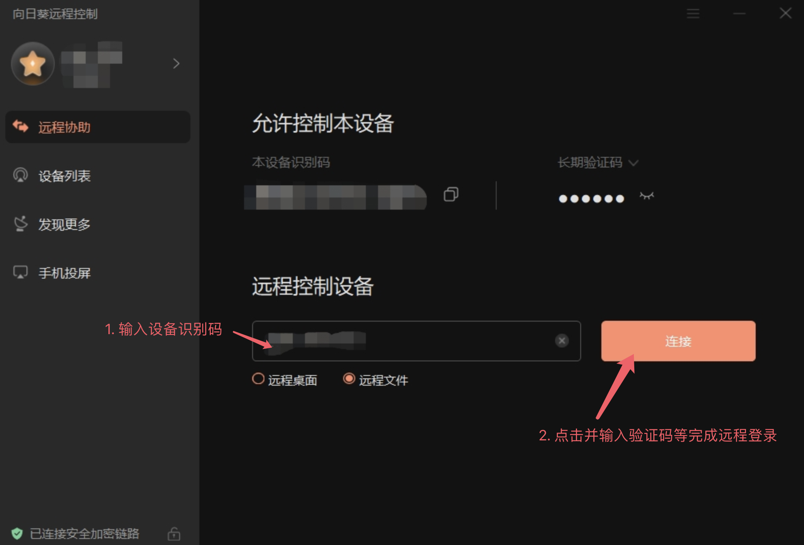
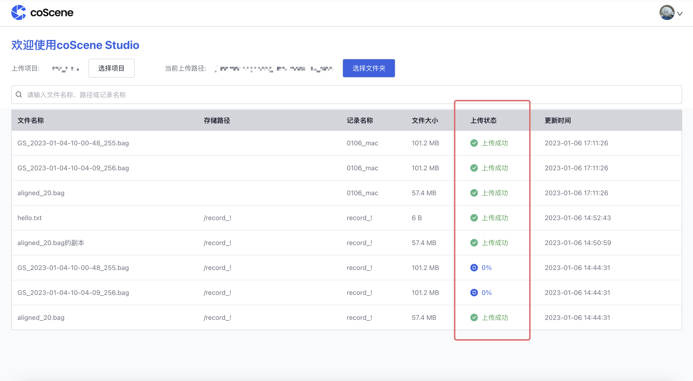
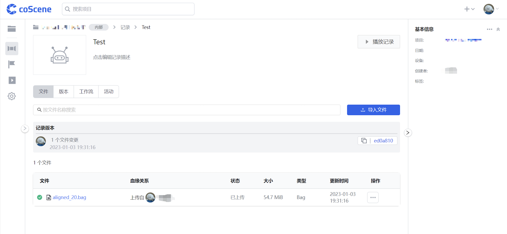

# 上传文件

## 1. 从本地上传文件

您可以在设置的上传路径下创建多级分类目录，每个非空的末级文件夹会在云端对应创建一条记录；您可以将文件拖动到文件夹中，文件夹中的文件会自动上传至所属文件夹对应的记录中：

## 2. 远程从设备拉取文件

如果您使用向日葵等远程拉取文件的应用，可以直接在该应用中将数据从设备下的文件拖动到指定的上传路径下:

## 3. 查看文件上传信息

您可以通过 coScene Studio 界面查看上传的文件信息与上传状态等：

在「上传状态」栏显示「上传成功」后即完成文件上传。

您可以在 coScene 网页端看到生成的记录与上传成功的设备文件：

