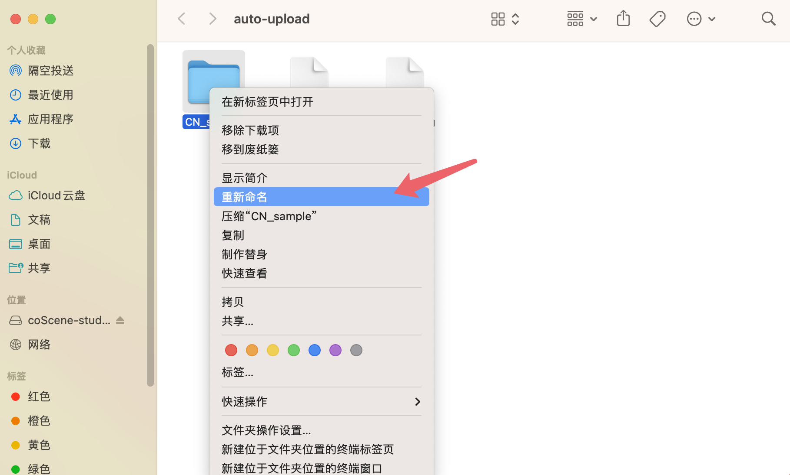

# 修改上传路径

## 1. 上传路径中编辑文件

您对上传路径中的文件的移动、修改、删除等操作，对于已上传到云端的文件不会有任何影响。

## 2. 上传路径中编辑文件夹

您可以对上传路径中的文件夹进行重命名、删除、更改内容等操作。

- ### 重命名

    您可以在指定的上传路径中选择要重命名的子文件夹，点击右键，选择「重新命名」，对子文件夹进行重命名:
    
    
    
    请注意若要重命名某一文件夹，请先关闭 coScene Studio，否则有可能出现「文件夹正在使用」警告，无法进行文件夹重命名。

- ### 删除

    您可以删除指定的上传路径中的子文件夹。
    
- ### 更改内容

    您可以在指定的上传路径及其子文件夹中增加、删除或编辑文件。
    
- ### 其他情况

    若您删除了上传路径，您会收到重新选择的提示。

