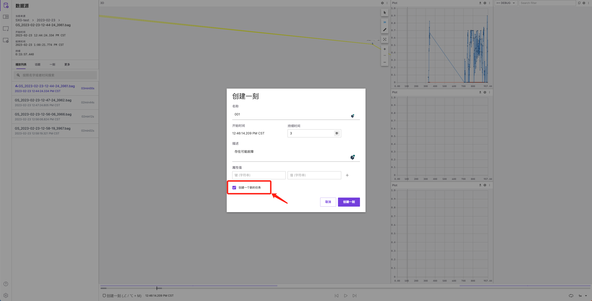
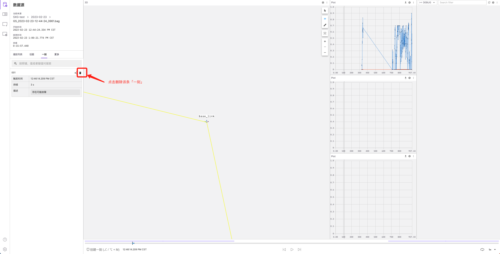
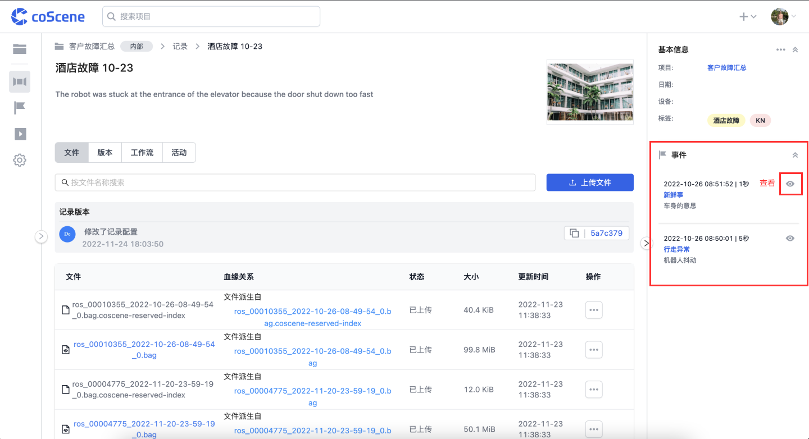

# 创建，分享与查看「一刻」

你可以在记录的可视化页面内创建，编辑并分享该记录中的关键帧「一刻」，它们可以是记录中的标签、故障或有趣的画面。

观看本章节中提供的图文说明与视频教程，了解可视化界面中有关「一刻」的操作。

## 1. 创建「一刻」

你可以在记录的可视化界面播放至某一时间点时，点击播放进度条上方的「创建一刻」按钮或使用相应快捷键，以创建从当前时间点开始的的「一刻」：

<video src="https://coscene-artifacts-prod.oss-cn-hangzhou.aliyuncs.com/docs/2-get-started/create-moment.mp4" controls="controls" width="700" height="400"></video>

 

在创建「一刻」时，你可以选择同时创建一条关联的任务：

该条「一刻」的链接会被自动添加至任务描述中。

 

## 2. 在可视化界面查看与编辑「一刻」

在时间轴上，可以看到蓝色高亮标记出的所有「一刻」。

你可以在可视化界面左侧的「一刻」列表中，查看该记录内已创建的「一刻」详情；点击某条「一刻」，播放进度会跳转到其起始时间。

<video src="https://coscene-artifacts-prod.oss-cn-hangzhou.aliyuncs.com/docs/2-get-started/click-moment.mp4" controls="controls" width="700" height="400"></video>

 

在「一刻」列表中，你可以点击某条「一刻」右上方的【删除】图标，删除该「一刻」：

 

## 3. 查看记录中的所有「一刻」

在记录详情页右侧的「一刻」列表中，你可以查看记录中所有的「一刻」并点击跳转至可视化界面内对应「一刻」的起始时间：

 

## 4. 分享「一刻」链接

你可以在可视化界面左侧的「一刻」列表中，点击想要分享的「一刻」右上方的【复制链接】图标，即可一键复制该「一刻」的链接。

将链接发送给协作伙伴，获得该链接且具有对应记录查看权限的用户，即可通过链接直接跳转到可视化页面中该「一刻」的起始时间。

<video src="https://coscene-artifacts-prod.oss-cn-hangzhou.aliyuncs.com/docs/2-get-started/copy-moment-link.mp4" controls="controls" width="700" height="400"></video>

 
