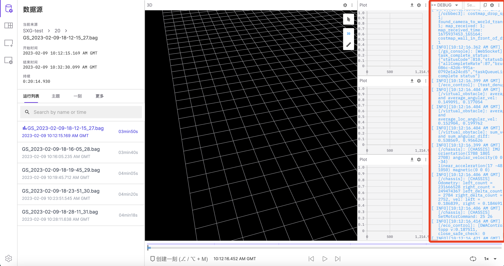

# 查看和设置日志

## 查看日志

在播放记录时，日志面板实时展示当前播放时间点话题中的 log 信息；默认展示 /rosout 中的 log。

## 切换播放日志

## 过滤与搜索日志

你可以按照严重等级和节点类型过滤日志信息。

观看以下视频，了解如何根据消息类型、节点类型或关键词搜索过滤日志信息。

<video src="https://coscene-artifacts-prod.oss-cn-hangzhou.aliyuncs.com/docs/4-receipts/viz/log-filter.mp4" controls="controls" width="700" height="400"></video>

## 导入日志
