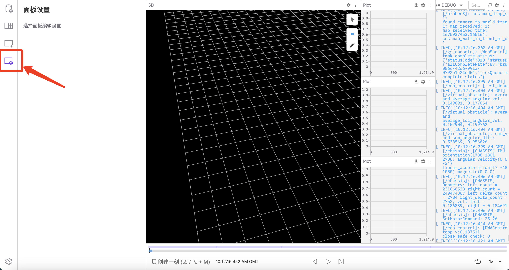

# 设置页面布局

可视化界面提供多种类型的面板，支持自定义布局配置和排列不同面板，以适应不同项目的独特需求和工作流程。本章节将展示如何进行面板和布局管理。

## 添加与设置面板

点击边栏的「添加面板」选项卡，查看包含多种类型面板的列表。单击面板名称将其添加到当前布局，或者将面板名称拖放到当前布局中以将其添加到特定位置。

<video src="https://coscene-artifacts-prod.oss-cn-hangzhou.aliyuncs.com/docs/4-receipts/viz/add-panel.mp4" controls="controls" width="700" height="400"></video>

点击边栏的「面板设置」选项卡，之后点击布局中的某面板以打开其设置。

 

## 设置布局

在边栏的「布局」选项卡中可管理与设置布局，包括新建布局、切换布局、重命名、本地导入导出 json 格式的布局文件、重置布局、删除布局等操作。

<video src="https://coscene-artifacts-prod.oss-cn-hangzhou.aliyuncs.com/docs/4-receipts/viz/layout-settings.mp4" controls="controls" width="700" height="400"></video>
