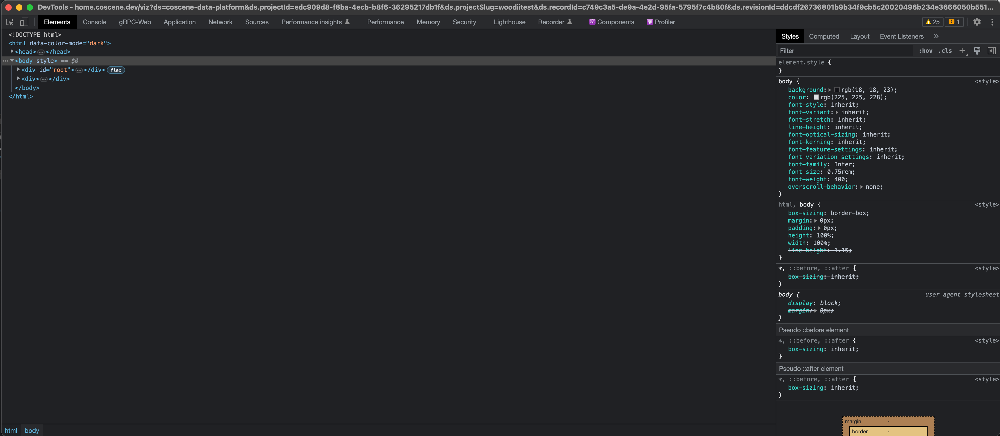
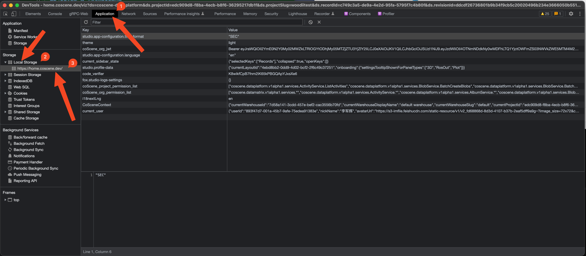
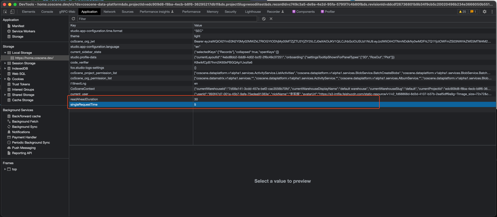

# 高级功能

可视化界面的「偏好」界面提供关于界面显示、语言、隐私、实验性功能等设置。

## 设置显示语言

点击可视化界面右下角的「偏好」图标，打开偏好设置界面，修改相应设置。

## 调整预加载时间长度以及单次请求时间长度
> 该功能请谨慎使用，可能导致无法预料的网页卡顿或页面崩溃。

### 关键词解释
- 预加载时间长度：提前于当前播放位置向后加载的数据长度，单位为秒，默认值为三十秒，如设置过长可能导致因为占用设备内存过大而导致的卡顿甚至网页崩溃。
- 单次请求时间长度：每次向服务器请求数据的长度，单位为秒，默认值为五秒，如设置过长可能导致服务器处理时间加长甚至请求失败

### 设置方法
- 按住 `F12` 键，打开开发者工具
  
- 在开发者工具中，点击 `Application` 标签页 然后点击 `Storage` 标签页 再然后点击当前网站的网址
  
- 在 `Local Storage` 最下方中双击添加 `readAheadDuration` 和 `singleRequestTime` 两个键值对，分别设置预加载时间长度和单次请求时间长度，单位为秒
  
- 刷新页面即可生效

ps: 如果已经设置过，可以直接在 `Local Storage` 中直接修改对应的值