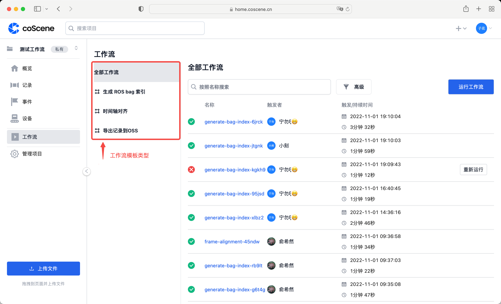
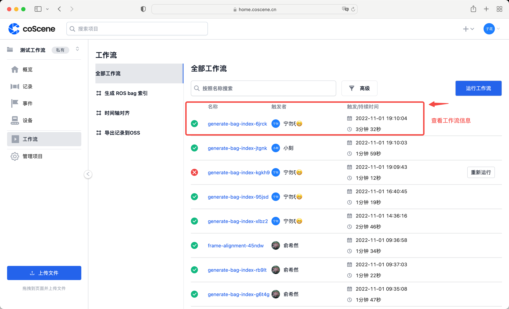
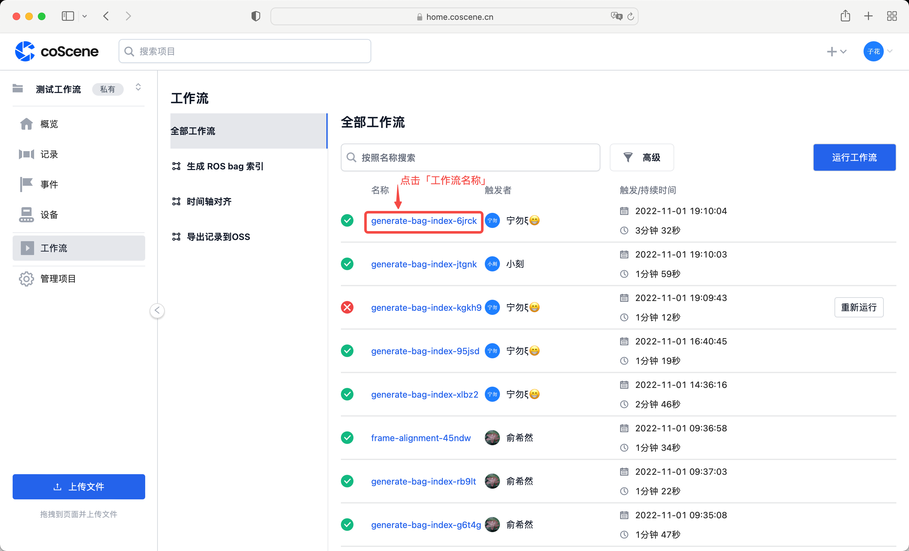
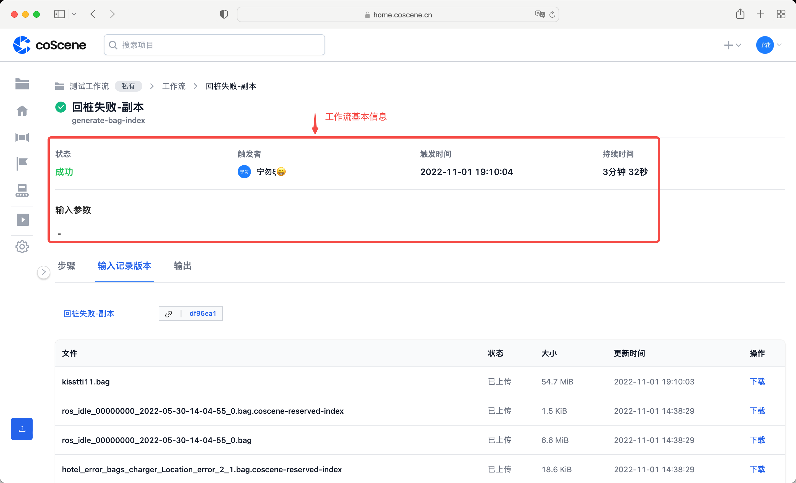
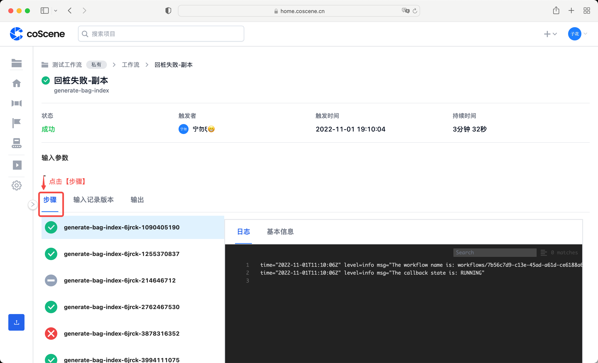
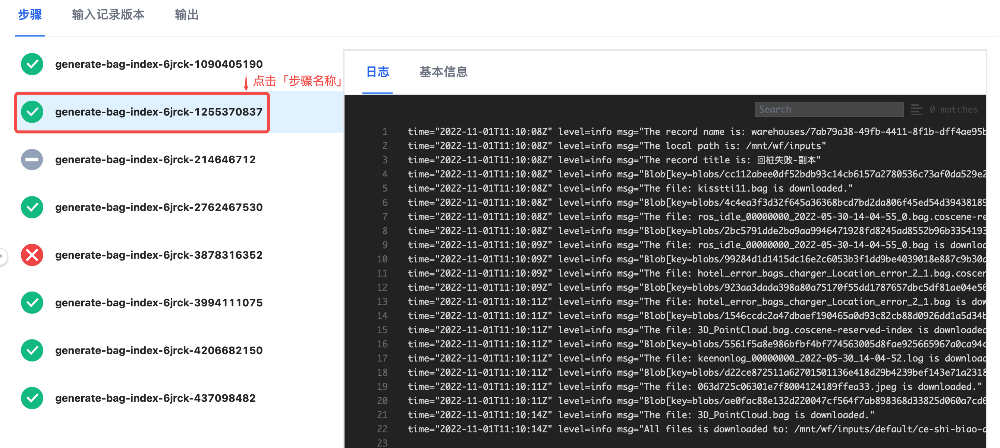
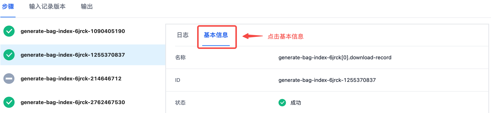
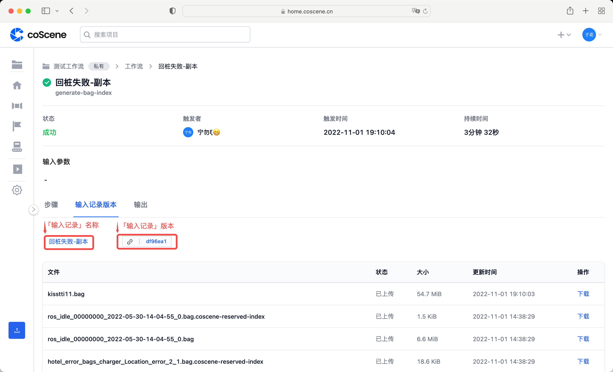
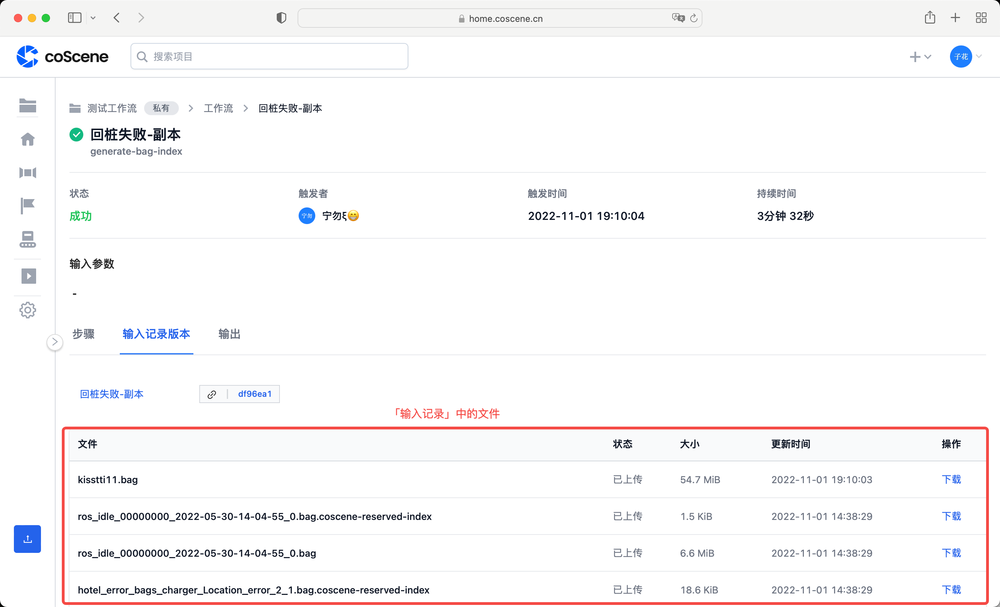
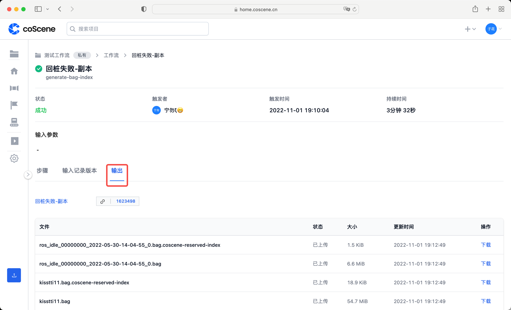

# 查看工作流的运行

触发工作流后，将创建一个执行任务的工作流。工作流开始运行后，您可以看到运行进度的列表，并在 coScene 上查看每个步骤的日志和基本信息。

## 工作流列表

在「工作流列表」中，展示了项目中所有的工作流，您可以便捷查看工作流的运行结果。

在项目的左侧边栏，点击【工作流】，进入项目的工作流页面。

在左侧列表中，展示了工作流的模板类型。点击待查看的模板类型，展开对应的工作流列表。

在工作流列表中，展示了工作流状态、名称、触发者、触发时间以及持续时间。

## 工作流详情

在「工作流详情」中，展示了单个工作流的详细信息，您可以更加全面地了解该工作流的运行结果。

选择待查看的工作流，点击「工作流名称」，进入工作流详情页。工作流详情页分为四部分：**基本信息、各步骤日志和信息、输入、输出**。

### 基本信息

工作流详情页的上方显示了基本信息，包括：工作流状态、触发者、触发时间、持续时间以及输入参数。

### 各步骤的日志和信息

当工作流运行完成后，在工作流的「步骤」分页，会以列表的形式展示工作流的运行步骤。

点击待查看的步骤，展示该步骤的工作流日志。

在工作流日志的搜索框中，输入关键词，能够高亮显示检索结果。

点击【基本信息】，可以查看该步骤的主要信息：名称、ID、状态等。

### 输入&输出

**切换到工作流的「输入记录版本」分页。**

- 展示输入的记录名称和版本。点击「记录名称」，跳转到该记录；点击「版本链接」，跳转到对应的记录版本。

  

- 下方列表中，展示了输入工作流的记录中，包含的文件信息。

  

**切换到工作流的【输出】分页。**

- 展示输出的信息。

  
