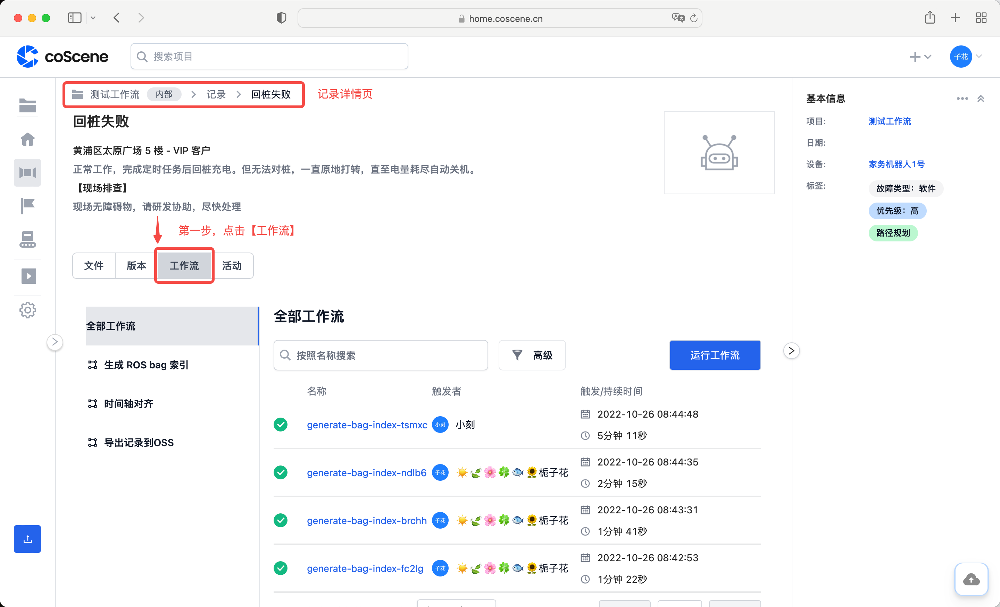
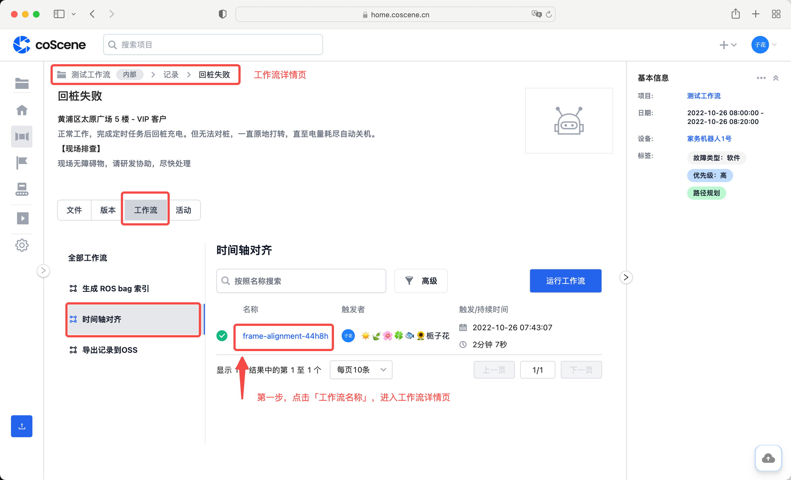
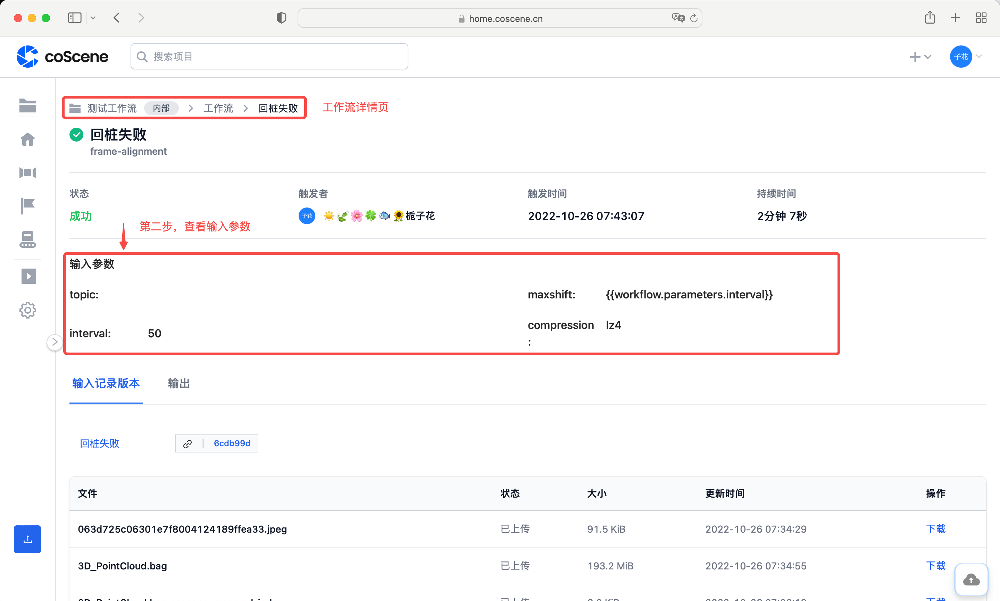

# 工作流参数

刻行的工作流支持运行时传入参数作为工作流的输入，这些参数在整个工作流的运行生命周期中都可以被使用。

本章节以用户触发**「生成 ROS bag 索引」**这个工作流为例，展示自定义输入参数的值。当工作流运行完成后，在工作流详情页面能看到输入的参数。

## 输入参数

在有 Bag 文件的记录中，进入「工作流」分页。

在左侧全部工作流列中，点击【时间轴对齐】。

在「时间轴对齐」的工作流页面，点击【运行工作流】按钮。

跳出「运行工作流」弹框，可自定义输入参数的值。其中：

- **compression**： 为输出包时使用的压缩方式，默认「lz4」。
- **interval**： 为帧间隔，默认「50ms」。
- **topic**： 为要提取用于对齐的主题，默认提取全部 topic。

根据需要编辑输入参数后，点击【运行】按钮，触发工作流。

## 查看参数

在记录详情页的「工作流」分页，进入「时间轴对齐」的工作流页面。点击待查看工作流的名称，进入工作流详情页。

在工作流详情页，查看运行工作流时的输入参数。

