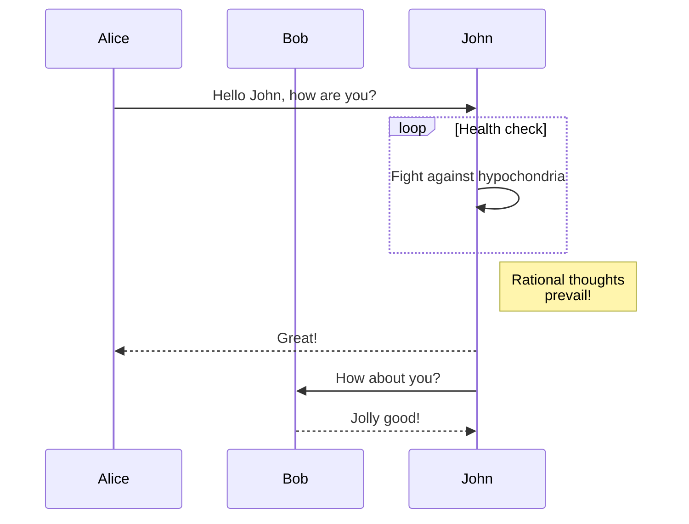

# 如何贡献

本节将引导你了解如何向本网站贡献。

## 网站特性

### Mermaid Support

[Mermaid 文档](https://docusaurus.io/docs/markdown-features/diagrams)

````

````


## 文档编写

如果你不熟悉 Markdown 语法，请先阅读 [Markdown 基本语法](https://docs.github.com/en/get-started/writing-on-github/getting-started-with-writing-and-formatting-on-github/basic-writing-and-formatting-syntax)

1. 准备文档网站的开发环境

```
git clone https://github.com/coscene-io/docs
npm install
```

2. 在任何支持 Markdown 的编辑器中编写完整的内容。例如，[VSCode](https://code.visualstudio.com/)，[Typora](https://typora.io/)，或[Notion](https://notion.so/)。
3. 把你的文档加入到对应的文件夹中，具体的文件结构，请参看[文件结构说明](https://tutorial.docusaurus.io/docs/category/tutorial---basics)
4. 使用 `npm run start` 来预览文档效果
5. 如果一切顺利，提交 PR 到 Docs 仓库
6. CI 会将改动自动部署到 `https://docs.coscene.cn`
